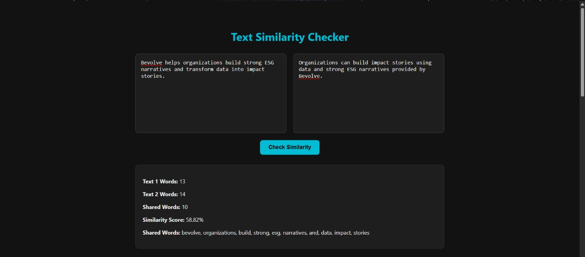

# Text Similarity Checker — Thought process

- ###  Fair Text Comparison

   To ensure a fair comparison, I first cleaned the input texts by removing punctuation (such as commas, periods, etc.) and converting all words to lowercase. This way, "Hello" and "hello" are treated as the same word.

- ### Word Extraction

  Each text is split into individual words. By placing these words into sets, I automatically ignore duplicate words in each text.

- ###  Finding Shared Words

  I then checked which words appear in both sets, effectively identifying the unique words shared between the two texts.

- ### Similarity Calculation

  The similarity score is calculated using the formula:  
    `(Number of shared words) / (Total unique words) * 100` to get a percentage.  

## How I Built It

- **Backend:**  
  Used plain Node.js HTTP server to handle requests. It takes two texts, processes them, calculates similarity, and saves the result in MongoDB. I added endpoints to get the history.  

- **Frontend:**  
  Built with React. It has two big text boxes side by side, a button to check similarity, and shows the results nicely. Also added a history section to show past checks.  

- **Constraints:**  
  Minimum Text length : 10 words
  Removed Punctuations and case insensitive

## Output

